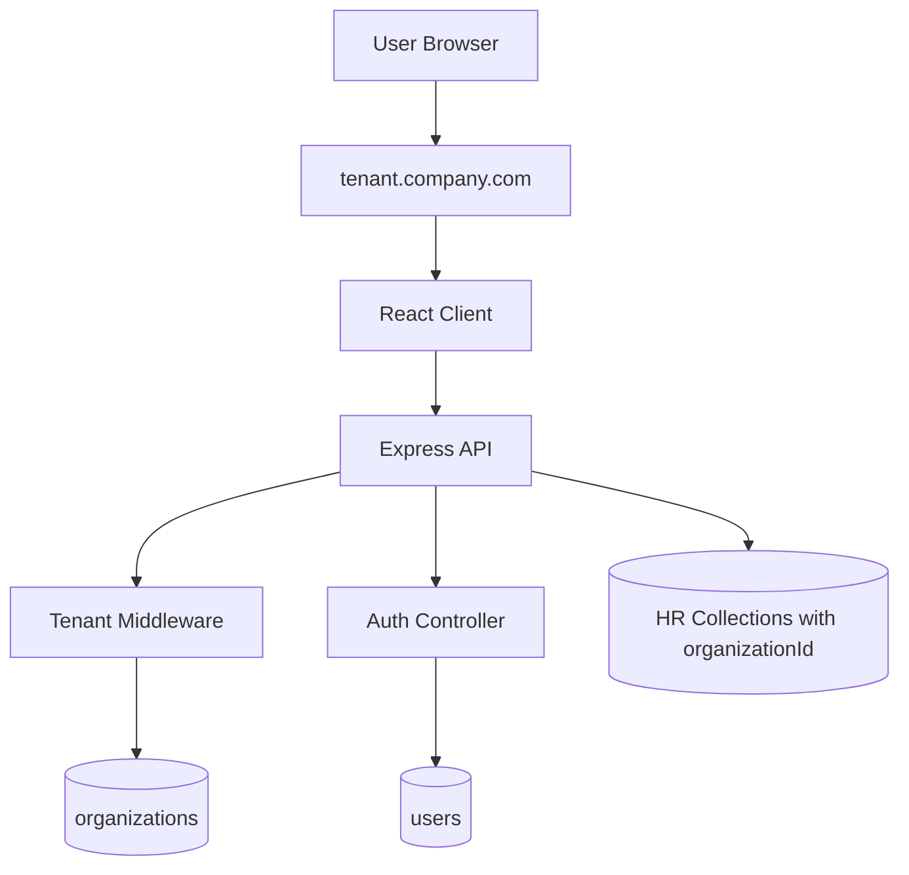

# HRMS Multi-Tenant Platform (React + TypeScript + Node + Express + MongoDB)

This repository now contains a production-style starter for a **multi-company HRMS** where each company is isolated by **subdomain**.

Example tenant URLs:
- `acme.yourdomain.com`
- `globex.yourdomain.com`

## Tech Stack

- Frontend: React + TypeScript + Vite
- Backend: Node.js + Express + TypeScript
- Database: MongoDB + Mongoose
- Auth: JWT (access + refresh tokens)
- Multi-tenancy model: **Shared DB, tenant isolation by `organizationId` + subdomain resolution**

## Architecture (Multi-Tenant)



## How Tenant Resolution Works

1. Frontend resolves company from hostname (`acme.localhost` => `acme`).
2. Frontend sends `x-tenant-subdomain` header on API requests.
3. Backend `resolveTenant` middleware finds `organizations.subdomain`.
4. Backend attaches tenant context to `req.tenant`.
5. Auth/data queries are scoped by `req.tenant.organizationId`.

If there is **no subdomain** (for example `localhost`), the app opens **Super Admin mode**.

## Key Backend Endpoints

- `POST /api/platform/organizations` (platform access protected)
  - Creates organization + initial admin user (+ optional `logoDataUrl`)
- `GET /api/platform/organizations` (platform access protected)
- `DELETE /api/platform/organizations/:id` (platform access protected)
- `GET /api/platform/organizations/:id/settings` (platform access protected)
- `PUT /api/platform/organizations/:id/settings` (platform access protected, deep-merge update)
- `POST /api/platform/auth/login` (super admin login at root domain)
- `POST /api/auth/register` (tenant-aware)
- `POST /api/auth/login` (tenant-aware)
- `POST /api/auth/google-login` (tenant-aware, Google sign-in)
- `POST /api/auth/forgot-password`
- `POST /api/auth/reset-password`
- `POST /api/auth/verify-email`
- `POST /api/auth/resend-verification`
- `POST /api/auth/refresh-token` (tenant-aware, refresh token rotation)
- `POST /api/auth/logout` (tenant-aware, refresh token revoke)
- `GET /api/auth/me` (tenant-aware + JWT)
- `GET /api/employees` (tenant-aware + RBAC)
- `GET /api/employees/:id` (tenant-aware + RBAC)
- `POST /api/employees` (tenant-aware + RBAC)
- `PUT /api/employees/:id` (tenant-aware + RBAC)
- `DELETE /api/employees/:id` (tenant-aware + RBAC)
- `POST /api/v1/attendance/punch-in`
- `POST /api/v1/attendance/punch-out`
- `GET /api/v1/attendance/my-attendance`
- `GET /api/v1/attendance/daily/:date`
- `GET|POST|PUT|DELETE /api/v1/attendance/settings`
- `GET|POST|PUT|DELETE /api/v1/attendance/office-locations`
- `GET /api/v1/attendance/pending-approvals`
- `POST /api/v1/attendance/approve/:punchId`
- `POST /api/v1/attendance/reject/:punchId`
- `POST /api/v1/attendance/approve/bulk`
- `POST /api/v1/attendance/regularize`
- `GET /api/v1/attendance/regularization-requests`
- `POST /api/v1/attendance/regularization/approve/:id`
- `POST /api/v1/attendance/regularization/reject/:id`
- `GET /api/v1/attendance/reports/*`
- `GET /api/v1/attendance/reports/export?reportType=...&format=csv|excel|pdf`
- `GET /api/v1/attendance/monitoring/realtime`
- `POST /api/v1/attendance/import/csv`
- `POST /api/v1/attendance/import/biometric`

## Project Structure

```text
hr_portal/
  client/                    # React + TypeScript app
  server/                    # Express + TypeScript API
  package.json               # Workspace scripts
```

## Local Setup

### 1. Install dependencies

```bash
npm install
```

### 2. Configure backend env

Copy `server/.env.example` to `server/.env` and set values.

Required additions for platform onboarding:
- `PLATFORM_ADMIN_KEY=your-secret-key`
- `SUPER_ADMIN_EMAIL=superadmin@hrms.local`
- `SUPER_ADMIN_PASSWORD=ChangeMeStrong`
- `GOOGLE_CLIENT_ID=...` (required for Google login)
- `SMTP_HOST`, `SMTP_PORT`, `SMTP_USER`, `SMTP_PASS`, `SMTP_FROM` (for real email delivery)

If SMTP is not configured, emails are mocked to server logs for local development.

### 3. Configure frontend env

Copy `client/.env.example` to `client/.env`.

Default local values already support subdomains under `localhost`.

### 4. Run app

```bash
npm run dev
```

- Frontend: `http://localhost:5173`
- Backend: `http://localhost:5000`

### 5. Create a company tenant (PowerShell)

```powershell
Invoke-RestMethod -Method Post `
  -Uri "http://localhost:5000/api/platform/organizations" `
  -Headers @{ "x-platform-key" = "your-secret-key" } `
  -ContentType "application/json" `
  -Body '{
    "name": "Acme Corp",
    "subdomain": "acme",
    "adminName": "Acme Admin",
    "adminEmail": "admin@acme.com",
    "adminPassword": "Pass@12345"
  }'
```

### 6. Open tenant portal

- `http://acme.localhost:5173/login`

Login with the tenant admin credentials you created.

### 7. Super admin portal (root domain)

- `http://localhost:5173/super-admin/login`

Use `SUPER_ADMIN_EMAIL` and `SUPER_ADMIN_PASSWORD` from `server/.env`.

## Deployment Notes for Real Subdomains

- Configure wildcard DNS:
  - `*.yourdomain.com` -> Frontend/load balancer
  - `api.yourdomain.com` -> Backend/load balancer
- Keep `ALLOWED_ROOT_DOMAIN=yourdomain.com` in backend env.
- Ensure proxy forwards original host (`x-forwarded-host`).
- Use HTTPS everywhere and secure cookie/token practices in production.

## What is Scaffolded vs Remaining

### Included now
- Tenant detection (frontend + backend)
- Company onboarding endpoint
- Tenant-aware auth flow
- Refresh token persistence + rotation + logout revoke
- Tenant-scoped employee CRUD module
- Attendance module foundation:
  - Attendance settings schema and scoped overrides (company/department/shift)
  - Office locations schema with geofencing and department/shift restrictions
  - Attendance punch schema with GPS/device/photo/approval/regularization fields
  - Geofence + time + device + photo validation services
  - Punch in/out APIs with invalid-handling modes and working-hours calculation
  - Attendance history + daily detail APIs (map-ready payloads)
  - Invalid punch approval workflow and bulk approval
  - Regularization APIs with monthly limits and age validation
  - Report APIs + export to CSV/Excel/PDF
  - Bulk CSV/biometric import with validation and cutoff invalidation
  - Socket.IO realtime live punch + occupancy events
- Forgot password + reset password
- Email verification for new user registration
- Google login for tenant users
- TypeScript workspace setup
- Login UI inspired by your reference design

### Next implementation steps
- Remaining HR modules: leave, payroll, claims, performance, recruitment
- RBAC permission matrix expansion and audit logs
- Per-tenant branding and config UI
- CI/CD + test suite + observability
